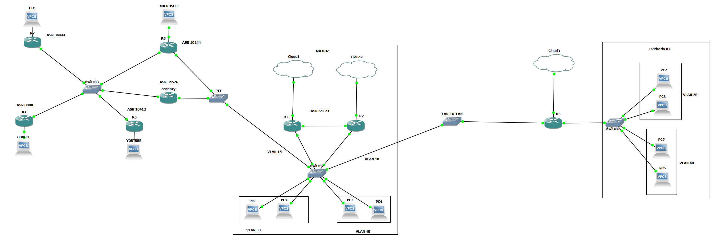

# autotainer-net-automation

O AutoTainer é um projeto open source com material totalmente em portugues, contendo uma arquitetura de automação baseada em eventos trabalhando em conjunto com containers, microserviços e kubernetes(utilizado kind).

O principal objetivo é possuir em mãos toda a arquitetura de rede como código desde o setup inicial até o IBN(estado de rede desejavel), sendo possível realizar testes de configurações antes de implementações da mesma forma que fazemos com softwares, além da identificação de problemas com base em logs ou mensagens customizadas.

# Arquitetura da Rede
